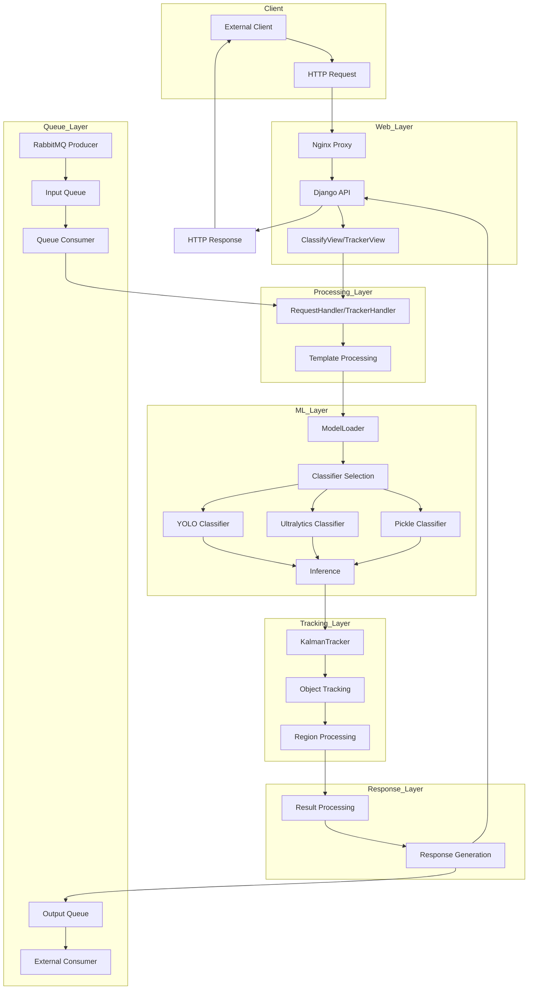

# AIVision Core Architecture

## Overview

AIVision Core is a Python-based computer vision platform designed for image classification and object detection using state-of-the-art deep learning models. The system provides a robust REST API for processing images with customizable processing templates, making it suitable for a wide range of industrial and commercial applications.

## System Architecture



## Component Details

### 1. Web Layer

#### Nginx Proxy
- Serves as the entry point for HTTP requests
- Handles SSL termination
- Provides load balancing capabilities
- Serves static files

#### Django API
- Built on Django REST Framework
- Provides RESTful API endpoints
- Handles request validation
- Manages authentication and authorization

#### API Endpoints
- `/classifier/classify`: For image classification
- `/tracker/track`: For object tracking

### 2. Processing Layer

#### RequestHandler
- Processes classification requests
- Parses and validates processing templates
- Coordinates the classification workflow
- Handles error conditions

#### TrackerHandler
- Processes tracking requests
- Manages object tracking across frames
- Handles region of interest processing
- Calculates object counters

#### Template Processing
- Parses JSON templates
- Validates template structure
- Extracts model configurations
- Processes region of interest definitions

### 3. Machine Learning Layer

#### ModelLoader
- Loads ML models based on configuration
- Manages model lifecycle
- Handles model versioning
- Provides model caching for performance

#### Classifier Types
- **YOLO Classifier**: Uses YOLO (You Only Look Once) for object detection
- **Ultralytics Classifier**: Uses Ultralytics implementation of YOLOv8
- **Pickle Classifier**: Uses serialized scikit-learn models

#### Inference
- Performs model inference on images
- Processes raw model outputs
- Applies confidence thresholds
- Formats detection results

### 4. Tracking Layer

#### KalmanTracker
- Implements Kalman filter for object tracking
- Assigns tracking IDs to objects
- Tracks objects across frames
- Handles object appearance and disappearance

#### Region Processing
- Processes regions of interest
- Calculates object-region overlaps
- Applies region-specific rules
- Counts objects in regions

### 5. Response Layer

#### Result Processing
- Processes detection and tracking results
- Applies business rules
- Formats results according to template
- Prepares response data

#### Response Generation
- Constructs JSON response
- Includes metadata (timestamps, client ID)
- Formats according to API contract
- Handles error responses

### 6. Queue Layer

#### RabbitMQ Integration
- Provides asynchronous processing capability
- Allows for distributed workloads
- Supports high-throughput scenarios
- Enables system scaling

## Directory Structure

```
aivision-core/
├── apps/                 # Django applications
├── base/                 # Base Django settings
├── data/                 # Data storage
│   └── scripts/          # Utility scripts
├── logs/                 # Log files
├── manage.py             # Django management script
├── mediafiles/           # Media storage
├── requirements.txt      # Python dependencies
├── src/                  # Core source code
│   ├── enum/             # Enumeration definitions
│   ├── handler/          # Request handlers
│   │   ├── request_handler.py  # Classification handler
│   │   └── tracker_handler.py  # Tracking handler
│   ├── job/              # Background jobs
│   ├── ml/               # Machine learning components
│   │   ├── classifier/   # Classifier implementations
│   │   │   ├── pickle_classifier/
│   │   │   ├── ultralytics_classifier/
│   │   │   └── yolo_classifier/
│   │   └── loader/       # Model loading utilities
│   └── utils/            # Utility functions
│       ├── classifier_utils.py
│       ├── detection_utils.py
│       ├── image_processing_utils.py
│       ├── json_utils.py
│       ├── model_utils.py
│       ├── template_utils.py
│       ├── tracking/
│       │   ├── kalman_tracker.py
│       │   └── tracking_utils.py
│       ├── tracker_file_utils.py
│       └── workstation_utils.py
└── staticfiles/          # Static files
```

## Key Classes and Functions

### RequestHandler

The `RequestHandler` class is responsible for processing classification requests:

```python
class RequestHandler:
    @staticmethod
    def process_request(classifier_suite, image=None, processing_template=None):
        # Process image and template
        # Run inference with appropriate classifier
        # Process results according to template rules
        # Return formatted response
```

### TrackerHandler

The `TrackerHandler` class handles object tracking across frames:

```python
class TrackerHandler:
    # Dictionary to store trackers for each client
    client_trackers = {}

    @staticmethod
    def process_tracking_request(classifier_suite, image=None, processing_template=None):
        # Process image and template
        # Detect objects using classifiers
        # Update object tracks using Kalman filter
        # Process regions of interest
        # Count objects and calculate metrics
        # Return tracking response
```

### KalmanTracker

The `KalmanTracker` class implements object tracking using Kalman filters:

```python
class KalmanTracker:
    def __init__(self, max_disappeared=50, max_distance=50):
        # Initialize tracker with parameters
        # Set up data structures for tracking

    def register(self, centroid, detection):
        # Register new object with tracking ID

    def deregister(self, object_id):
        # Deregister disappeared object

    def update(self, detections):
        # Update object tracks with new detections
        # Match existing tracks with new detections
        # Register new objects
        # Deregister disappeared objects
        # Return updated tracks
```

## Processing Flow

### Classification Flow

1. Client sends image and processing template to `/classifier/classify` endpoint
2. RequestHandler processes the request
3. Image is decoded and prepared for classification
4. Models specified in the template are loaded
5. Inference is performed on the image
6. Results are processed according to template rules
7. Response is formatted and returned to client

### Tracking Flow

1. Client sends image and processing template to `/tracker/track` endpoint
2. TrackerHandler processes the request
3. Image is decoded and prepared for classification
4. Objects are detected using specified models
5. KalmanTracker updates object tracks
6. Regions of interest are processed
7. Object counters are calculated
8. Response is formatted and returned to client

## Template Format

The processing template defines how images should be processed:

```json
{
  "clientId": "client123",
  "frameId": "frame456",
  "frameTimestamp": "2023-01-01T12:00:00Z",
  "models": [
    {
      "modelName": "model_name",
      "classLabels": ["class1", "class2"]
    }
  ],
  "workstations": [
    {
      "workstationName": "workstation1",
      "regionsOfInterest": [
        {
          "regionName": "region1",
          "polygonCoordinates": [[x1, y1], [x2, y2], ...],
          "detectionRules": [
            {
              "models": [
                {
                  "modelName": "model_name",
                  "classLabels": ["class1"]
                }
              ],
              "enableTracking": true,
              "checkInRegion": true,
              "instantCount": true
            }
          ]
        }
      ]
    }
  ]
}
```

## Response Format

The response includes detection and tracking information:

```json
{
  "status": "success",
  "clientId": "client123",
  "frameId": "frame456",
  "frameTimestamp": "2023-01-01T12:00:00Z",
  "processTimestamp": "2023-01-01T12:00:01Z",
  "objectsInFrame": [
    {
      "classLabel": "class1",
      "confidence": 0.95,
      "workstationName": "workstation1",
      "regionName": "region1",
      "boundingBox": {
        "x": 100,
        "y": 200,
        "width": 50,
        "height": 50
      },
      "inRegion": true,
      "modelName": "model_name",
      "trackingId": "track123"
    }
  ],
  "detections": [
    {
      "classLabel": "class1",
      "startTimestamp": "2023-01-01T12:00:00Z",
      "endTimestamp": "2023-01-01T12:00:01Z",
      "counterSince": "2023-01-01T12:00:00Z",
      "trackingIds": ["track123"],
      "workstations": [
        {
          "workstationName": "workstation1",
          "modelName": "model_name",
          "regionsOfInterests": [
            {
              "regionName": "region1",
              "counter": 1,
              "instantCounter": 1
            }
          ]
        }
      ]
    }
  ]
}
```

## Deployment

AIVision Core is containerized using Docker and can be deployed using Docker Compose:

```yaml
version: '3'

services:
  web:
    build: .
    ports:
      - "80:80"
    volumes:
      - ./data:/app/data
    env_file:
      - .env
    depends_on:
      - rabbitmq

  rabbitmq:
    image: rabbitmq:3-management
    ports:
      - "5672:5672"
      - "15672:15672"
    environment:
      - RABBITMQ_DEFAULT_USER=guest
      - RABBITMQ_DEFAULT_PASS=guest
```

## Conclusion

AIVision Core provides a flexible and powerful platform for image classification and object detection. Its modular architecture allows for easy extension and customization, while its API-first design enables seamless integration with other systems.
