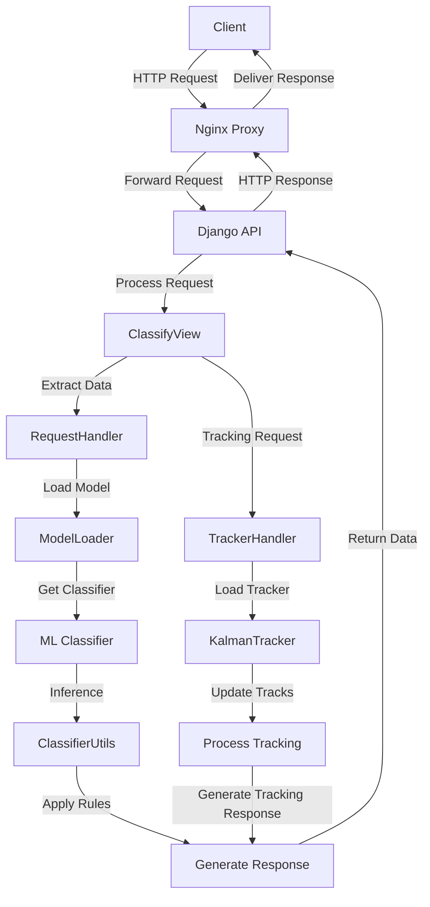
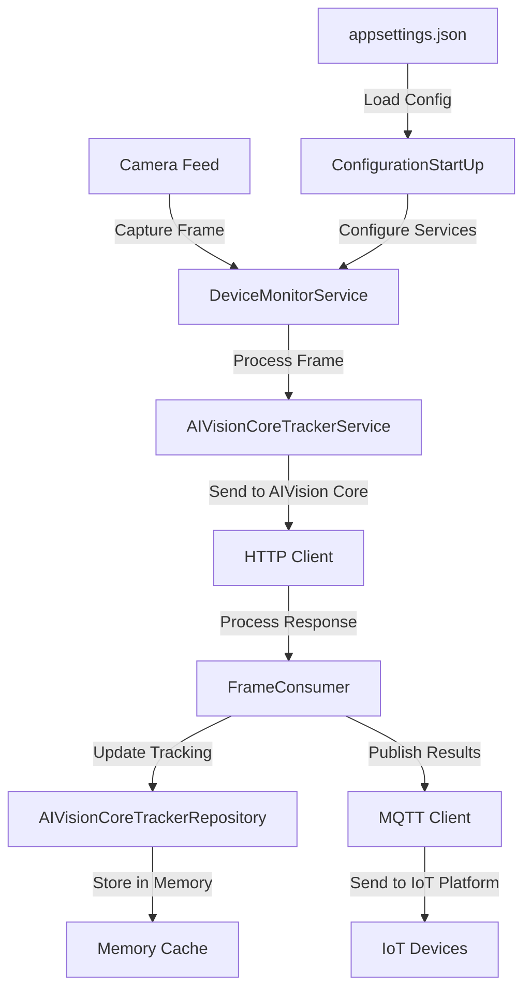
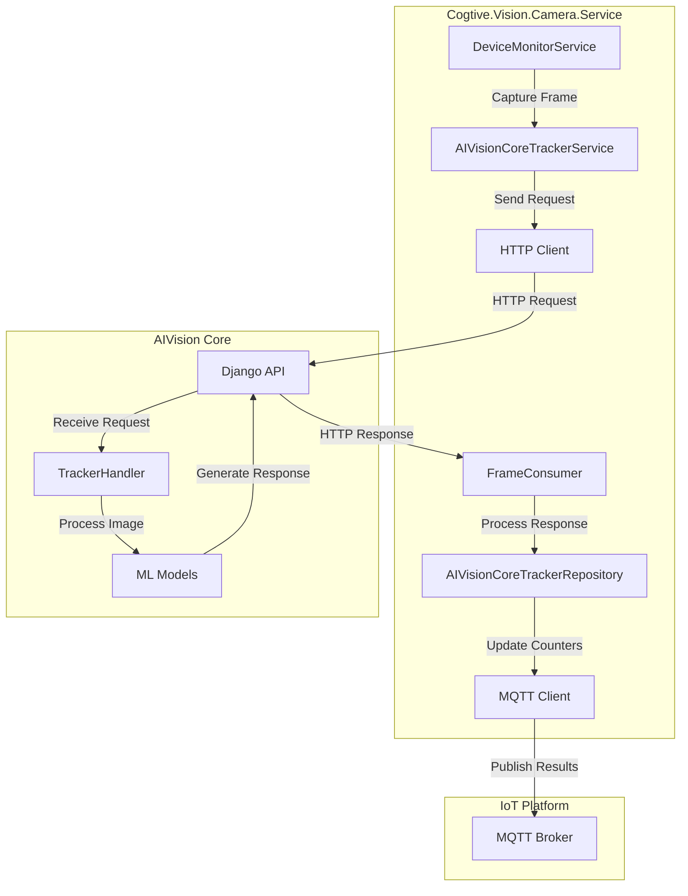

# COGTIVE Vision System Architecture Documentation

## Table of Contents
1. [Introduction](#introduction)
2. [Project Overview](#project-overview)
3. [AIVision Core Architecture](#aivision-core-architecture)
4. [Cogtive.Vision.Camera.Service Architecture](#cogtiviesioncameraservice-architecture)
5. [Integration Architecture](#integration-architecture)
6. [Design Decisions](#design-decisions)
7. [Workflow Diagrams](#workflow-diagrams)

## Introduction

This document provides a comprehensive architectural overview of the COGTIVE Vision System, which consists of two main projects:
1. **AIVision Core** - A Python-based computer vision platform for image classification and object detection
2. **Cogtive.Vision.Camera.Service** - A .NET-based service for camera management and integration with AIVision Core

The document outlines the architecture of each project, their integration points, key design decisions, and workflow diagrams.

## Project Overview

### AIVision Core

AIVision Core is an advanced computer vision platform designed for image classification and object detection using state-of-the-art deep learning models. The system provides a robust REST API for processing images with customizable processing templates, making it suitable for a wide range of industrial and commercial applications.

Key features include:
- Image classification and object detection using multiple ML models
- Template-based configuration for flexible processing pipelines
- REST API for integration with other systems
- RabbitMQ integration for asynchronous processing
- Object tracking capabilities

### Cogtive.Vision.Camera.Service

Cogtive.Vision.Camera.Service is a .NET-based service that manages camera feeds and integrates with AIVision Core for processing video frames. It handles the acquisition of camera feeds, sends frames to AIVision Core for processing, and manages the results.

Key features include:
- Camera feed management
- Integration with AIVision Core
- MQTT publishing for IoT integration
- Tracking and counting of detected objects
- Configuration management for multiple clients and workstations

## AIVision Core Architecture

### System Components

The AIVision Core architecture consists of the following key components:

1. **Web Application Layer**
   - Django REST Framework for API endpoints
   - Gunicorn as the WSGI HTTP server
   - Nginx as the reverse proxy and static file server

2. **Processing Layer**
   - Classification module with multiple model support
   - Request handler for processing incoming requests
   - Template-based configuration for flexible processing pipelines
   - Tracker handler for object tracking

3. **Machine Learning Layer**
   - Multiple classifier implementations (YOLO, Ultralytics, Pickle)
   - Model loading and management system
   - Inference optimization for production environments

4. **Message Queue Layer**
   - RabbitMQ integration for asynchronous processing
   - Producer and consumer services for distributed workloads
   - Queue-based communication between system components

5. **Utility Layer**
   - Image processing utilities
   - Detector utilities for post-processing
   - Configuration management
   - Tracking utilities

### Directory Structure

```
aivision-core/
├── apps/
├── base/
├── data/
├── logs/
├── manage.py
├── mediafiles/
├── requirements.txt
├── src/
│   ├── enum/
│   ├── handler/
│   │   ├── request_handler.py
│   │   └── tracker_handler.py
│   ├── job/
│   ├── ml/
│   │   ├── classifier/
│   │   │   ├── pickle_classifier/
│   │   │   ├── ultralytics_classifier/
│   │   │   └── yolo_classifier/
│   │   └── loader/
│   └── utils/
└── staticfiles/
```

### Data Flow

1. **Request Ingestion**:
   - Client submits an image and processing template via REST API
   - Nginx routes the request to the Django application
   - ClassifyView endpoint receives and validates the request

2. **Request Processing**:
   - RequestHandler processes the request with the specified classifier suite
   - The image is decoded and prepared for classification
   - Processing template is parsed to determine classification parameters

3. **Model Inference**:
   - ClassifierLoader loads the appropriate model based on configuration
   - The model performs inference on the prepared image
   - Results are post-processed according to the template rules

4. **Tracking Processing** (when enabled):
   - TrackerHandler processes the detection results
   - KalmanTracker is used for object tracking across frames
   - Tracking IDs are assigned to detected objects

5. **Response Generation**:
   - ClassifierUtils processes detection results against template rules
   - Matching rules generate appropriate output data
   - Response is formatted and returned to the client

## Cogtive.Vision.Camera.Service Architecture

### System Components

The Cogtive.Vision.Camera.Service architecture consists of the following key components:

1. **Domain Layer**
   - Core business entities and interfaces
   - AIVisionCore integration models
   - Camera and IoT domain models

2. **Application Layer**
   - Application services
   - Business logic implementation
   - Dispatching services

3. **Infrastructure Layer**
   - External service implementations
   - Repository implementations
   - Configuration management
   - MQTT client implementation

4. **Worker Layer**
   - Background services
   - Frame consumer service
   - Device monitoring service

### Directory Structure

```
Cogtive.Vision.Camera.Service/
└── src/
    ├── Cogtive.Vision.Camera.Service.Aplication/
    │   ├── AIVisionCore/
    │   ├── Camera/
    │   └── Dispatching/
    ├── Cogtive.Vision.Camera.Service.Domain/
    │   ├── AIVisionCore/
    │   │   └── Tracker/
    │   ├── Camera/
    │   ├── Client/
    │   ├── Generic/
    │   ├── Iot/
    │   ├── Math/
    │   ├── Message/
    │   ├── Mqtt/
    │   ├── TEST/
    │   └── Workstation/
    ├── Cogtive.Vision.Camera.Service.Framework/
    ├── Cogtive.Vision.Camera.Service.Infrastructure/
    │   ├── AIVisionCore/
    │   ├── Camera/
    │   ├── Channels/
    │   ├── Configuration/
    │   ├── Dispatching/
    │   ├── Extension/
    │   └── Mqtt/
    ├── Cogtive.Vision.Camera.Service.Tests/
    └── Cogtive.Vision.Camera.Service.Worker/
        ├── ConfigurationStartUp.cs
        ├── DeviceMonitorService.cs
        ├── FrameConsumer.cs
        └── Program.cs
```

### Data Flow

1. **Camera Feed Acquisition**:
   - Camera feeds are configured in appsettings.json
   - DeviceMonitorService monitors camera devices
   - Frames are captured from RTSP streams

2. **Frame Processing**:
   - Captured frames are sent to AIVision Core for processing
   - Processing templates are configured per client and workstation
   - Regions of interest are defined for each workstation

3. **Result Processing**:
   - FrameConsumer receives processing results from AIVision Core
   - Results are stored in memory cache
   - Counters are updated based on tracking information

4. **IoT Integration**:
   - Processed results are published to MQTT topics
   - IoT devices can subscribe to these topics
   - Data is formatted according to IoT platform requirements

## Integration Architecture

The integration between AIVision Core and Cogtive.Vision.Camera.Service is achieved through:

1. **REST API**:
   - Cogtive.Vision.Camera.Service sends HTTP requests to AIVision Core
   - Images and processing templates are sent in the request
   - Results are returned in a standardized JSON format

2. **Message Queue**:
   - RabbitMQ is used for asynchronous processing
   - Cogtive.Vision.Camera.Service can publish messages to input queues
   - AIVision Core processes these messages and publishes results to output queues

3. **Shared Data Models**:
   - Both systems use compatible data models for requests and responses
   - Processing templates define the configuration for both systems
   - Tracking information is shared between systems

## Design Decisions

### 1. Separation of Computer Vision and Camera Management

**Decision**: Split the system into two separate projects - AIVision Core for computer vision and Cogtive.Vision.Camera.Service for camera management.

**Rationale**:
- Allows each system to be developed and scaled independently
- Enables the use of appropriate technologies for each domain (Python for ML, .NET for camera management)
- Provides flexibility in deployment options
- Makes it easier to reuse the computer vision capabilities with different camera systems

### 2. Template-Based Configuration

**Decision**: Use template-based configuration for processing pipelines.

**Rationale**:
- Provides flexibility to configure different processing pipelines for different clients
- Enables non-technical users to configure the system without code changes
- Allows for dynamic reconfiguration without system restarts
- Supports complex processing rules and region-of-interest definitions

### 3. Tracking Implementation

**Decision**: Implement object tracking using Kalman filters.

**Rationale**:
- Kalman filters provide robust tracking in the presence of noise
- Enables tracking of objects across frames even with occlusions
- Supports counting of objects as they move through regions of interest
- Provides a foundation for more complex analytics

### 4. Memory Cache for Tracking Data

**Decision**: Use in-memory cache for tracking data in Cogtive.Vision.Camera.Service.

**Rationale**:
- Provides fast access to tracking data
- Avoids database overhead for frequently changing data
- Simplifies the architecture for real-time processing
- Sufficient for the current scale of the system

### 5. MQTT for IoT Integration

**Decision**: Use MQTT for publishing results to IoT platforms.

**Rationale**:
- MQTT is a lightweight protocol suitable for IoT applications
- Provides publish/subscribe model for flexible integration
- Widely supported by IoT platforms
- Efficient for real-time data transmission

## Workflow Diagrams

### AIVision Core Workflow



### Cogtive.Vision.Camera.Service Workflow



### Integration Workflow



This architecture documentation provides a comprehensive overview of both projects, their integration, and the key design decisions that shaped the system. The workflow diagrams illustrate the data flow through the system and how the different components interact.
