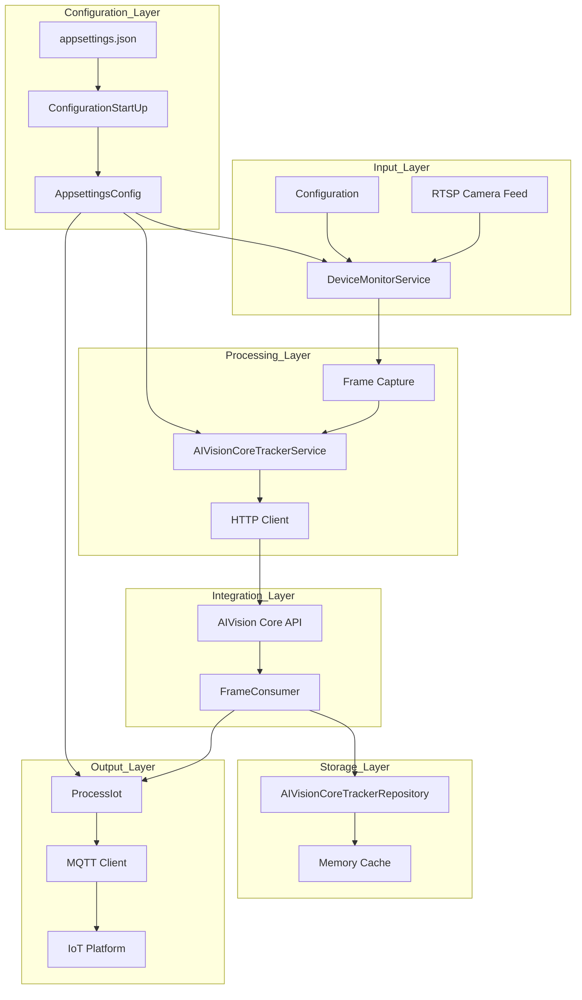

# Cogtive.Vision.Camera.Service Architecture

## Overview

Cogtive.Vision.Camera.Service is a .NET-based service that manages camera feeds and integrates with AIVision Core for processing video frames. It handles the acquisition of camera feeds, sends frames to AIVision Core for processing, and manages the results, including publishing to MQTT for IoT integration.

## System Architecture



## Architecture Patterns

The Cogtive.Vision.Camera.Service follows a clean architecture pattern with the following layers:

1. **Domain Layer**: Core business entities and interfaces
2. **Application Layer**: Business logic and application services
3. **Infrastructure Layer**: External service implementations and repositories
4. **Worker Layer**: Background services and process orchestration

## Component Details

### 1. Domain Layer

The Domain layer contains the core business entities and interfaces that represent the business model and rules.

#### Key Components:

- **AIVisionCore Models**: Data models for interacting with AIVision Core
- **Camera Models**: Camera and device-related domain entities
- **IoT Models**: IoT message and event models
- **Workstation Models**: Workstation and region of interest models

#### Key Interfaces:

- `IAIVisionCoreTrackerRepository`: Interface for tracking data repository
- `IAIVisionCoreTrackerService`: Interface for AIVision Core integration service
- `IProcessIot`: Interface for IoT processing

### 2. Application Layer

The Application layer contains the business logic and orchestrates the domain objects to perform tasks.

#### Key Components:

- **AIVisionCore Services**: Services for interacting with AIVision Core
- **Camera Services**: Services for managing camera feeds
- **Dispatching Services**: Services for dispatching messages and events

### 3. Infrastructure Layer

The Infrastructure layer provides implementations for interfaces defined in the domain layer and handles external concerns.

#### Key Components:

- **AIVisionCoreTrackerRepository**: Implementation of tracking data repository using memory cache
- **AIVisionCoreTrackerService**: Implementation of AIVision Core integration service
- **MQTT Client**: Implementation of MQTT client for IoT integration
- **Configuration**: Configuration management

### 4. Worker Layer

The Worker layer contains background services that run continuously to process data.

#### Key Components:

- **DeviceMonitorService**: Monitors camera devices and captures frames
- **FrameConsumer**: Consumes and processes results from AIVision Core
- **ConfigurationStartUp**: Handles application configuration and startup

## Directory Structure

```
Cogtive.Vision.Camera.Service/
└── src/
    ├── Cogtive.Vision.Camera.Service.Aplication/
    │   ├── AIVisionCore/         # AIVision Core integration services
    │   ├── Camera/               # Camera management services
    │   └── Dispatching/          # Message dispatching services
    ├── Cogtive.Vision.Camera.Service.Domain/
    │   ├── AIVisionCore/         # AIVision Core domain models
    │   │   └── Tracker/          # Tracking-related models
    │   ├── Camera/               # Camera domain models
    │   ├── Client/               # Client domain models
    │   ├── Generic/              # Generic domain models
    │   ├── Iot/                  # IoT domain models
    │   ├── Math/                 # Math utilities
    │   ├── Message/              # Message models
    │   ├── Mqtt/                 # MQTT models
    │   ├── TEST/                 # Test-related models
    │   └── Workstation/          # Workstation domain models
    ├── Cogtive.Vision.Camera.Service.Framework/
    │   # Framework-level components
    ├── Cogtive.Vision.Camera.Service.Infrastructure/
    │   ├── AIVisionCore/         # AIVision Core integration implementations
    │   ├── Camera/               # Camera service implementations
    │   ├── Channels/             # Channel implementations
    │   ├── Configuration/        # Configuration implementations
    │   ├── Dispatching/          # Dispatching implementations
    │   ├── Extension/            # Extension methods
    │   └── Mqtt/                 # MQTT client implementation
    ├── Cogtive.Vision.Camera.Service.Tests/
    │   # Unit and integration tests
    └── Cogtive.Vision.Camera.Service.Worker/
        ├── ConfigurationStartUp.cs  # Application configuration
        ├── DeviceMonitorService.cs  # Camera monitoring service
        ├── FrameConsumer.cs         # Result processing service
        └── Program.cs               # Application entry point
```

## Key Classes and Interfaces

### Domain Layer

#### IAIVisionCoreTrackerRepository

```csharp
public interface IAIVisionCoreTrackerRepository
{
    Task<LastTrackingModel> GetLastTrackerAsync(string clientId, string workstation);
    Task SetLatestTrackerAsync(LastTrackingModel lastTracking);
    Task RemoveLastTrackerAsync(string key);
}
```

#### LastTrackingModel

```csharp
public class LastTrackingModel
{
    public string ClientId { get; init; }
    public string Workstation { get; init; }
    public DateTime LastFrameTimestamp { get; set; }
    public DateTime LastCounterSince { get; set; }
    public Dictionary<string, LastTrackingDetectionModel> Detections { get; set; }

    public class LastTrackingDetectionModel
    {
        public string ClassLabel { get; set; }
        public string RegionName { get; set; }
        public int CounterTotal { get; set; }
        public int CounterCurrent { get; set; }
        public int InstantCounter { get; set; }
    }
}
```

#### FrameTrackerMessageResponse

```csharp
public class FrameTrackerMessageResponse
{
    public string ClientId { get; set; }
    public string FrameId { get; set; }
    public FrameTrackerMessageTrackerResponse TrackerResponse { get; set; }

    public class FrameTrackerMessageTrackerResponse
    {
        public string Status { get; set; }
        public string ClientId { get; set; }
        public string FrameId { get; set; }
        public DateTime FrameTimestamp { get; set; }
        public DateTime ProcessTimestamp { get; set; }
        public FrameTrackerMessageObjectsInFrameResponse[] ObjectsInFrame { get; set; }
        public FrameTrackerMessageDetectionResponse[] Detections { get; set; }

        // Nested classes for response structure
    }
}
```

### Infrastructure Layer

#### AIVisionCoreTrackerRepository

```csharp
public class AIVisionCoreTrackerRepository : IAIVisionCoreTrackerRepository
{
    private readonly IMemoryCache _memoryCache;

    public AIVisionCoreTrackerRepository(IMemoryCache memoryCache)
    {
        _memoryCache = memoryCache;
    }

    public async Task<LastTrackingModel> GetLastTrackerAsync(string clientId, string workstation)
    {
        var key = BuildKey(clientId, workstation);
        var result = _memoryCache.GetOrCreate(key, entry => new LastTrackingModel(clientId, workstation));
        return result;
    }

    public async Task SetLatestTrackerAsync(LastTrackingModel lastTracking)
    {
        var key = BuildKey(lastTracking);
        _memoryCache.Set(key, lastTracking);
    }

    public async Task RemoveLastTrackerAsync(string key)
    {
        _memoryCache.Remove(key);
    }

    private string BuildKey(LastTrackingModel lastTracking) =>
        BuildKey(lastTracking.ClientId, lastTracking.Workstation);

    private string BuildKey(string clientId, string workstation) =>
        $"{clientId}_{workstation}";
}
```

### Worker Layer

#### FrameConsumer

```csharp
public class FrameConsumer : BackgroundService
{
    private readonly IRabbitMqConsumerService _rabbit;
    private readonly IAIVisionCoreTrackerRepository _aIVisionCoreTrackerRepository;
    private readonly IProcessIot _processIot;
    private readonly ConcurrentDictionary<string, LastTrackingModel> _SendToMqtt;
    private readonly AppsettingsConfig _appsettingsConfig;

    protected override Task ExecuteAsync(CancellationToken stoppingToken)
    {
        _rabbit.StartConsuming<FrameTrackerMessageResponse>(async (message) =>
        {
            await UpdateLastTracking(message);
        });

        Task.Run(SendToMqtt, stoppingToken);

        return Task.CompletedTask;
    }

    private async Task UpdateLastTracking(FrameTrackerMessageResponse message)
    {
        // Process tracking response and update counters
        // Store updated tracking information in memory cache
        // Queue data for MQTT publishing
    }

    public async Task SendToMqtt()
    {
        // Periodically send tracking data to MQTT
        // Format data for IoT platform
        // Publish to MQTT topics
    }
}
```

## Configuration

The service is configured using `appsettings.json`, which includes:

1. **External Services Configuration**: URLs for external services like AIVision Core
2. **MQTT Configuration**: Connection details for MQTT broker
3. **Client Configuration**: Configuration for each client, including:
   - Model configurations
   - Camera device configurations
   - Workstation configurations
   - Region of interest definitions
   - Detection rules

Example configuration:

```json
{
    "Logging": {
        "LogLevel": {
            "Default": "Information",
            "Microsoft.AspNetCore": "Warning"
        }
    },
    "ExternalServices": {
        "AIVisionCore": "http://example.com:48000/"
    },
    "ConnectionStrings": {
        "Mqtt": {
            "Host": "mqtt.example.com",
            "Port": 8883,
            "Username": "username",
            "Password": "password",
            "MaxConnections": 50
        }
    },
    "ClientsConfiguration": [
        {
            "ClientId": "client1",
            "Models": [
                {
                    "ModelName": "model1",
                    "ClassLabels": [ "class1", "class2" ]
                }
            ],
            "Devices": [
                {
                    "Id": "device1",
                    "RtspUrl": "rtsp://camera.example.com/stream",
                    "CaptureIntervalMilliseconds": 50,
                    "Workstations": [
                        {
                            "WorkstationName": "workstation1",
                            "RegionsOfInterest": [
                                {
                                    "RegionName": "region1",
                                    "PolygonCoordinates": [
                                        [ 100, 100 ],
                                        [ 200, 100 ],
                                        [ 200, 200 ],
                                        [ 100, 200 ]
                                    ],
                                    "DetectionRules": [
                                        {
                                            "Models": [
                                                {
                                                    "ModelName": "model1",
                                                    "ClassLabels": [ "class1" ]
                                                }
                                            ],
                                            "EnableTracking": true,
                                            "CheckInRegion": true,
                                            "InstantCount": true
                                        }
                                    ]
                                }
                            ]
                        }
                    ]
                }
            ]
        }
    ]
}
```

## Processing Flow

### Frame Capture and Processing

1. **DeviceMonitorService** reads configuration from `appsettings.json`
2. For each configured device:
   - Connect to RTSP stream
   - Capture frames at specified intervals
   - For each frame:
     - Prepare processing template based on configuration
     - Send frame and template to AIVision Core
     - Process response

### Result Processing

1. **FrameConsumer** receives processing results from AIVision Core
2. For each detection in the response:
   - Retrieve last tracking information from cache
   - Update counters based on tracking information
   - Store updated tracking information in cache
   - Queue data for MQTT publishing

### IoT Integration

1. **SendToMqtt** method runs periodically
2. For each tracking entry in the queue:
   - Format data for IoT platform
   - Publish data to MQTT topics

## Deployment

The service is designed to be deployed as a .NET worker service, either:
- As a Windows Service
- As a Linux daemon
- In a Docker container

## Conclusion

Cogtive.Vision.Camera.Service provides a robust platform for managing camera feeds and integrating with AIVision Core for computer vision processing. Its clean architecture and modular design make it flexible and maintainable, while its configuration-driven approach allows for easy adaptation to different use cases without code changes.
