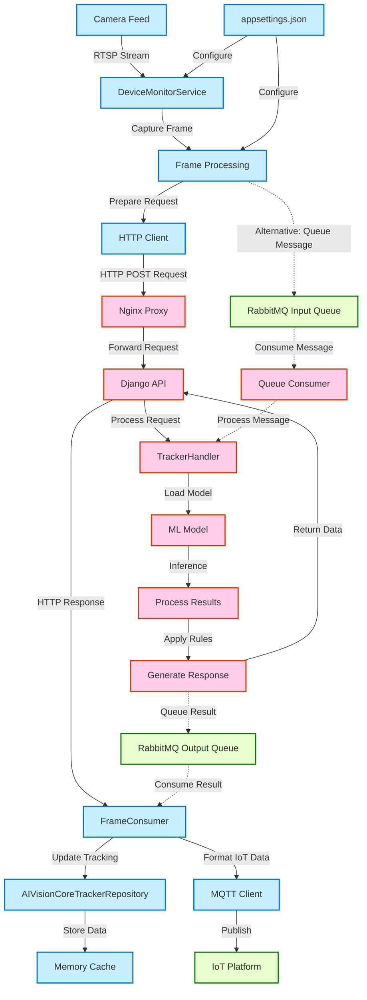

# Detailed Integration Workflow Between AIVision Core and Camera Service

## System Integration Architecture

## Detailed Data Flow

### 1. Frame Acquisition and Processing

1. **Camera Feed Acquisition**
   - DeviceMonitorService reads RTSP URL from configuration
   - Connects to camera stream and captures frames at configured intervals
   - Frames are captured as raw image data

2. **Frame Preparation**
   - Raw frame is encoded to a format suitable for HTTP transmission
   - Processing template is prepared based on configuration
   - Request payload is constructed with frame data and template

### 2. Request to AIVision Core

1. **HTTP Request Construction**
   - HTTP POST request is created with multipart/form-data
   - Image data is included as a file part
   - Processing template is included as a JSON part

2. **Request Transmission**
   - Request is sent to AIVision Core API endpoint
   - Connection timeout and retry logic is implemented
   - Request is logged for debugging purposes

### 3. AIVision Core Processing

1. **Request Handling**
   - Nginx receives the request and forwards to Django application
   - Django routes the request to the appropriate view
   - Request is validated and parsed

2. **Image Processing**
   - Image is decoded from request data
   - Processing template is parsed and validated
   - Models are loaded based on template configuration

3. **Object Detection**
   - ML models perform inference on the image
   - Detection results are filtered based on confidence thresholds
   - Bounding boxes are calculated for detected objects

4. **Object Tracking**
   - Kalman filter tracker updates object tracks
   - New objects are assigned tracking IDs
   - Existing objects are matched with previous tracks

5. **Region Processing**
   - Detected objects are checked against regions of interest
   - Overlap percentages are calculated
   - Region-specific rules are applied

6. **Response Generation**
   - Detection and tracking results are formatted
   - Response JSON is constructed
   - Response is returned to client

### 4. Camera Service Result Processing

1. **Response Handling**
   - FrameConsumer receives response from AIVision Core
   - Response is parsed and validated
   - Tracking information is extracted

2. **Tracking Update**
   - Last tracking information is retrieved from cache
   - Counters are updated based on tracking results
   - Updated tracking information is stored in cache

3. **IoT Integration**
   - Detection results are formatted for IoT platform
   - MQTT messages are constructed
   - Messages are published to configured topics

## Alternative: RabbitMQ Integration

For high-throughput scenarios, the system can use RabbitMQ for asynchronous processing:

1. **Message Publishing**
   - Camera Service encodes frame and template as a message
   - Message is published to RabbitMQ input queue
   - Message includes client ID, frame ID, and timestamp

2. **Message Consumption**
   - AIVision Core consumes messages from input queue
   - Messages are processed asynchronously
   - Results are published to output queue

3. **Result Consumption**
   - Camera Service consumes results from output queue
   - Results are processed similar to HTTP response
   - Processing continues asynchronously

This approach allows for better scalability and load distribution but adds complexity to the system architecture.
