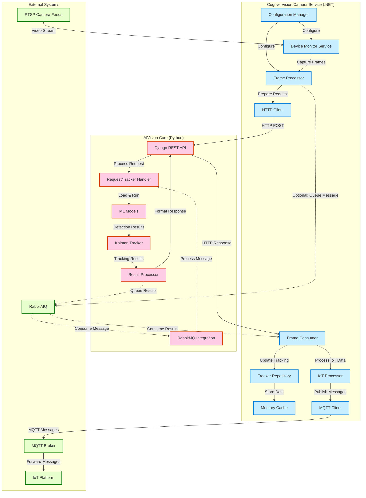

# Integration Architecture: AIVision Core and Camera Service

## System Integration Overview

This document describes the integration architecture between AIVision Core (Python-based computer vision platform) and Cogtive.Vision.Camera.Service (.NET-based camera management service).

## Integration Architecture Diagram



## Integration Points

### 1. REST API Integration

The primary integration between the two systems is through RESTful API calls:

#### Request Flow
1. **Camera Service** captures frames from RTSP camera feeds
2. Frames are encoded and packaged with a processing template
3. HTTP POST request is sent to AIVision Core's `/tracker/track` endpoint
4. AIVision Core processes the request and returns a response
5. Camera Service processes the response and updates tracking information

#### Request Format
```
POST /tracker/track
Content-Type: multipart/form-data

--boundary
Content-Disposition: form-data; name="image"; filename="frame.jpg"
Content-Type: image/jpeg

[Binary image data]
--boundary
Content-Disposition: form-data; name="processing_template"
Content-Type: application/json

{
  "clientId": "client123",
  "frameId": "frame456",
  "frameTimestamp": "2023-01-01T12:00:00Z",
  "models": [...],
  "workstations": [...]
}
--boundary--
```

#### Response Format
```json
{
  "status": "success",
  "clientId": "client123",
  "frameId": "frame456",
  "frameTimestamp": "2023-01-01T12:00:00Z",
  "processTimestamp": "2023-01-01T12:00:01Z",
  "objectsInFrame": [...],
  "detections": [...]
}
```

### 2. RabbitMQ Integration (Alternative/Optional)

For high-throughput scenarios, the systems can integrate through RabbitMQ:

#### Message Flow
1. **Camera Service** captures frames and publishes messages to input queue
2. AIVision Core consumes messages from input queue
3. AIVision Core processes frames and publishes results to output queue
4. Camera Service consumes results from output queue

#### Message Format (Input Queue)
```json
{
  "client_id": "client123",
  "frame_id": "frame456",
  "frame_timestamp": "2023-01-01T12:00:00Z",
  "frame_data": "base64_encoded_image_data",
  "processing_template": {
    "models": [...],
    "workstations": [...]
  }
}
```

#### Message Format (Output Queue)
```json
{
  "client_id": "client123",
  "frame_id": "frame456",
  "tracker_response": {
    "status": "success",
    "clientId": "client123",
    "frameId": "frame456",
    "frameTimestamp": "2023-01-01T12:00:00Z",
    "processTimestamp": "2023-01-01T12:00:01Z",
    "objectsInFrame": [...],
    "detections": [...]
  }
}
```

## Data Models Mapping

The integration between the two systems relies on shared data models:

### Processing Template

| Camera Service (.NET) | AIVision Core (Python) | Description |
|----------------------|------------------------|-------------|
| `ClientId` | `client_id` | Client identifier |
| `Models[].ModelName` | `models[].modelName` | ML model name |
| `Models[].ClassLabels` | `models[].classLabels` | Classes to detect |
| `Workstations[].WorkstationName` | `workstations[].workstationName` | Workstation identifier |
| `Workstations[].RegionsOfInterest[].RegionName` | `workstations[].regionsOfInterest[].regionName` | Region identifier |
| `Workstations[].RegionsOfInterest[].PolygonCoordinates` | `workstations[].regionsOfInterest[].polygonCoordinates` | Region coordinates |
| `Workstations[].RegionsOfInterest[].DetectionRules` | `workstations[].regionsOfInterest[].detectionRules` | Detection rules |

### Response Model

| AIVision Core (Python) | Camera Service (.NET) | Description |
|----------------------|------------------------|-------------|
| `status` | `Status` | Response status |
| `clientId` | `ClientId` | Client identifier |
| `frameId` | `FrameId` | Frame identifier |
| `frameTimestamp` | `FrameTimestamp` | Frame timestamp |
| `processTimestamp` | `ProcessTimestamp` | Processing timestamp |
| `objectsInFrame[].classLabel` | `ObjectsInFrame[].ClassLabel` | Detected class |
| `objectsInFrame[].confidence` | `ObjectsInFrame[].Confidence` | Detection confidence |
| `objectsInFrame[].trackingId` | `ObjectsInFrame[].TrackingId` | Tracking identifier |
| `detections[].classLabel` | `Detections[].ClassLabel` | Detection class |
| `detections[].counterSince` | `Detections[].CounterSince` | Counter start time |
| `detections[].workstations[].regionsOfInterests[].counter` | `Detections[].Workstations[].RegionsOfInterests[].Counter` | Object count |

## Configuration Synchronization

Both systems need to be configured with compatible settings:

### AIVision Core Configuration
- Model paths and configurations
- Tracking parameters
- API endpoints and authentication

### Camera Service Configuration
- AIVision Core API URL
- Client configurations
- Model names (must match AIVision Core models)
- Workstation and region definitions
- MQTT connection settings

## Error Handling and Resilience

The integration includes several error handling mechanisms:

1. **HTTP Request Failures**
   - Timeout handling
   - Retry logic
   - Circuit breaker pattern

2. **Processing Errors**
   - Error logging
   - Graceful degradation
   - Default values for missing data

3. **Connection Issues**
   - Connection pooling
   - Reconnection logic
   - Queuing of requests during outages

## Performance Considerations

The integration is designed with performance in mind:

1. **Throughput Optimization**
   - Asynchronous processing
   - Batch processing where applicable
   - Connection pooling

2. **Latency Reduction**
   - Optimized request/response formats
   - Efficient serialization/deserialization
   - Caching of frequently used data

3. **Resource Management**
   - Memory-efficient data structures
   - Resource pooling
   - Garbage collection optimization

## Security Considerations

The integration includes several security measures:

1. **Authentication and Authorization**
   - API keys or tokens
   - Role-based access control
   - Secure credential storage

2. **Data Protection**
   - TLS/SSL for all communications
   - Data encryption at rest
   - Secure handling of sensitive information

3. **Network Security**
   - Firewall rules
   - Network segmentation
   - Rate limiting

## Deployment Considerations

The integration can be deployed in several ways:

1. **Co-located Deployment**
   - Both systems deployed on the same network
   - Low latency between systems
   - Simplified network security

2. **Distributed Deployment**
   - Systems deployed in different locations
   - Higher latency, but more scalable
   - More complex network security

3. **Containerized Deployment**
   - Both systems deployed as Docker containers
   - Orchestrated with Kubernetes or Docker Compose
   - Simplified scaling and management

## Monitoring and Observability

The integration includes monitoring and observability features:

1. **Logging**
   - Structured logging in both systems
   - Correlation IDs for request tracing
   - Log aggregation

2. **Metrics**
   - Performance metrics
   - Error rates
   - Resource utilization

3. **Alerting**
   - Threshold-based alerts
   - Error rate alerts
   - Latency alerts

## Conclusion

The integration between AIVision Core and Cogtive.Vision.Camera.Service provides a robust foundation for computer vision applications. By leveraging REST APIs and optionally RabbitMQ, the integration supports both synchronous and asynchronous processing patterns, making it suitable for a wide range of use cases.
